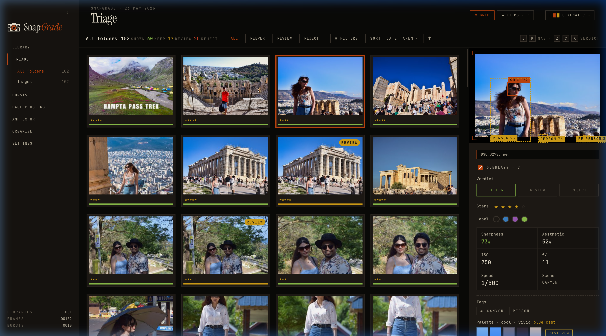
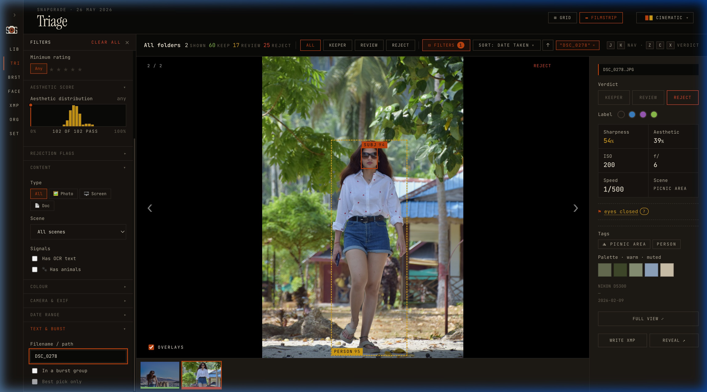
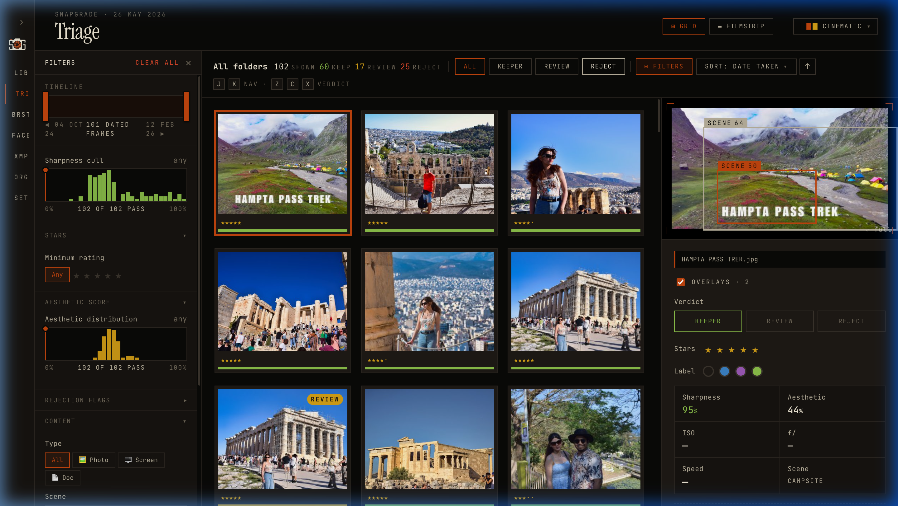
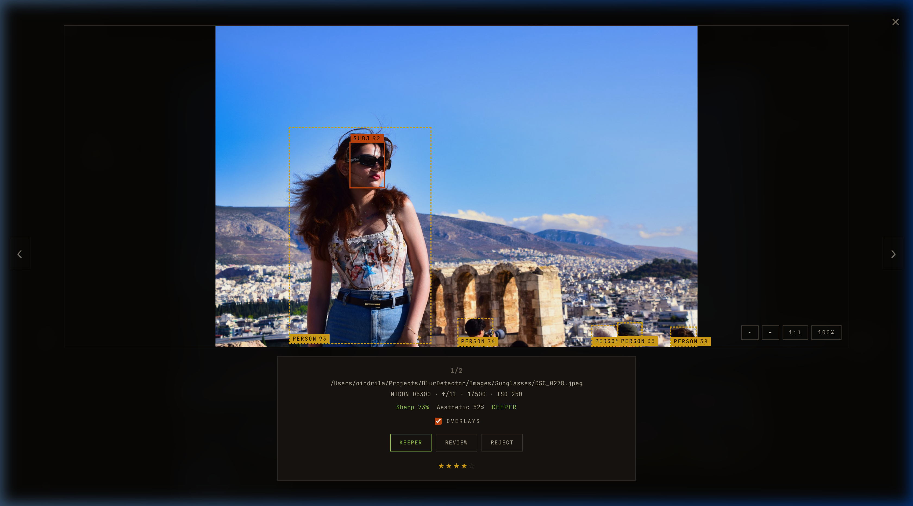
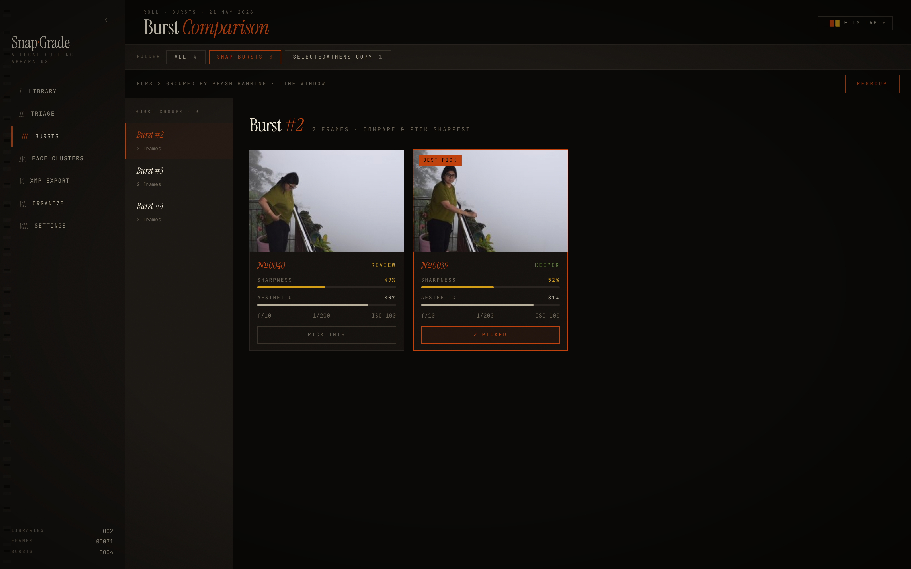
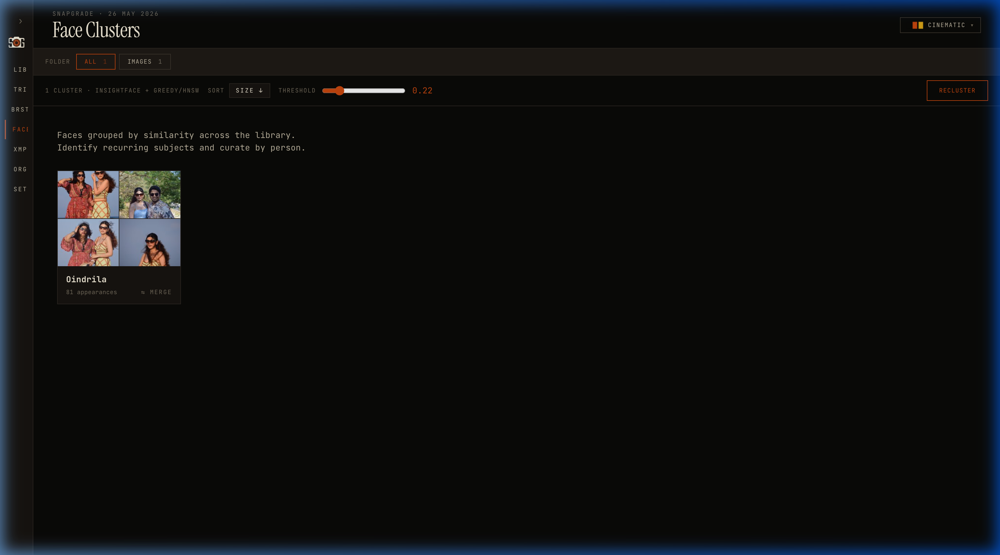
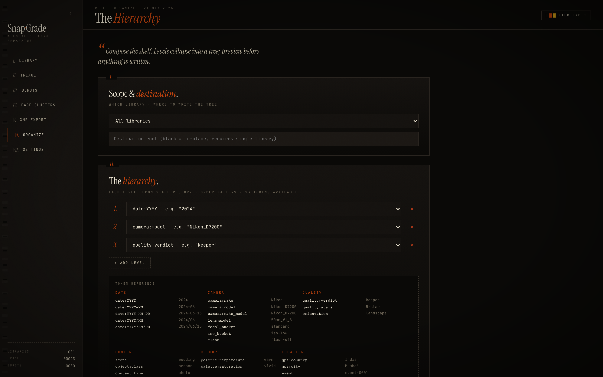
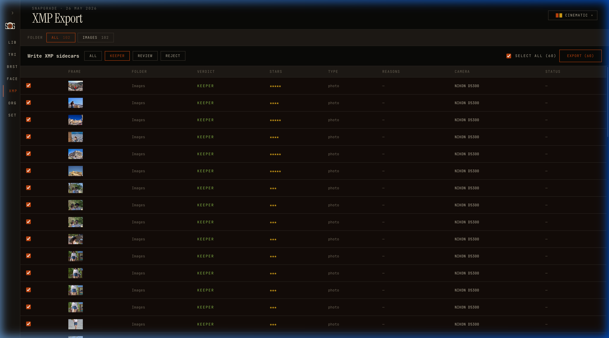

<div align="center">
  <picture>
    <source media="(prefers-color-scheme: dark)" srcset="docs/images/banner_dark.svg">
    <source media="(prefers-color-scheme: light)" srcset="docs/images/banner_light.svg">
    
  </picture>
</div>

<div align="center">

**Local, privacy-respecting photo triage and organizer.**

*Detects blur, closed eyes, exposure issues, groups bursts, clusters faces, searches by visual semantics, and organizes folders by EXIF + quality.*

[](https://www.python.org/downloads/)
[](LICENSE)
[](pyproject.toml)
[](https://github.com/astral-sh/uv)
[](https://github.com/Bibyutatsu/SnapGrade/releases/download/v0.2.0/SnapGrade-macOS.dmg)

<br/>

</div>

---

## Status

SnapGrade is ready for local culling workflows. It provides a FastAPI analyzer backend, SQLite metrics cache, CLI commands, and a React-based web dashboard. It features real-time face clustering, burst grouping, visual semantic search, and configurable quality thresholds.

---

## Features & Visual Walkthrough

### 1. Interactive Contact Sheet & Triage (Web UI)
* **Grid vs. Filmstrip Layouts**: Switch between a dense contact sheet for rapid scanning, and Filmstrip mode (large hero image with bottom thumbnail strip) for fast arrow-key evaluation.
* **Calibrated Themes**: Choose between *Film Lab* (warm amber dark mode), *Modern* (cool dark grey), and *Light Pro* (high-contrast light mode) to suit your editing suite's lighting conditions.

<div align="center">
  
  
</div>

---

### 2. Sharpness & Subject-Aware Detection
* **Three Sharpness Signals**: Combines Laplacian variance, Tenengrad gradient energy, and FFT directional energy to distinguish camera shake from out-of-focus blur.
* **Subject-Aware Focus**: Restricts sharpness analysis to detected subjects (using MediaPipe face landmarking or salient subject segmentation fallbacks) to avoid penalizing artistic background bokeh.

<div align="center">
  
</div>

---

### 3. Burst Management (Best-of-Burst)
* **Union-Find Grouping**: Automatically identifies and groups near-duplicate burst sequences using 64-bit perceptual hashes and timestamp proximity.
* **Best-of-Burst Selection**: Ranks frames within a group based on a composite quality score (sharpness, smile, exposure, open eyes) and highlights the best candidate.

<div align="center">
  
</div>

---

### 4. Face Detection & Clustering
* **Cosine Similarity Grouping**: Clusters detected faces using InsightFace `buffalo_s` embeddings.
* **Person Cards**: Generates cluster cards for every detected individual in the library, allowing single-click filtering of all images featuring that person.

<div align="center">
  
</div>

---

### 5. Hierarchical Organization & XMP Export
* **Custom Folder Templates**: Structure your output folder tree using metadata tokens (e.g., `{date:YYYY}/{camera_model}/{quality:verdict}`). Supports symbolic links or copy/move operations.
* **Lightroom Compatibility**: Write verdicts, ratings (1–5 stars), and rejection reasons to industry-standard XMP sidecars that Lightroom, darktable, and Bridge read automatically.

<div align="center">
  
  
</div>

---

## Installation

### 1. Prerequisites
- macOS (Apple Silicon or Intel)
- Python 3.10+
- [uv](https://docs.astral.sh/uv/) — fast Python package manager

Install `uv` if you don't have it:
```bash
curl -LsSf https://astral.sh/uv/install.sh | sh
```

### 2. Clone and Install
```bash
git clone https://github.com/Bibyutatsu/SnapGrade.git
cd SnapGrade
uv sync --all-extras
```

### 3. Verify
```bash
uv run snapgrade --help
```
---

## macOS Standalone Desktop App

> **[⬇ Download SnapGrade-macOS.dmg (v0.2.0)](https://github.com/Bibyutatsu/SnapGrade/releases/download/v0.2.0/SnapGrade-macOS.dmg)**  
> No Python or `uv` required — open the `.dmg`, drag **SnapGrade** to Applications, then launch it.

The app bundles the full Python backend as a sidecar binary and serves the web UI locally. On first launch, use **SnapGrade → Install Command Line Tool…** from the menu bar to make the `snapgrade` CLI available globally in your terminal.

For local compilation, `.dmg` packaging, and CI/CD release details see the [macOS Desktop App Guide](docs/macos_desktop.md).

---

## Documentation

For advanced setup, CLI usage, models registry, and configuration options, see:
- [SnapGrade Complete Guide & Reference](docs/guide.md) — Comprehensive guide to CLI commands, models, quickstart, and environment variables
- [Brand & UI Design System](docs/DESIGN.md) — UI theme colors and visual guidelines

---

## License

[MIT](LICENSE)
